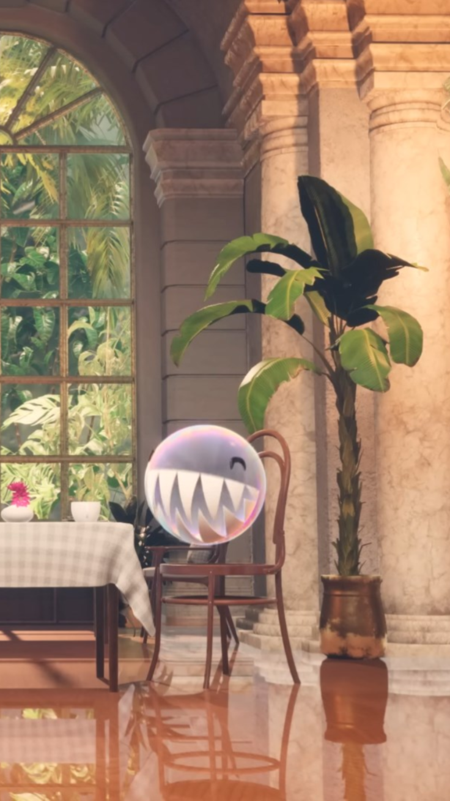

<pre>
    ⚙️  just a normal student :/
    💻  designing a custom laptop cuz i am bored
    🧠  AMD Ryzen 7 7840U  •  KiCad  •  Fusion 360
    🔌  learning pcb design by asking ai and tutorials
    🌱  started with scratch and now vibecoding circuits lol
    📍  moldova
</pre>

---

## 💻 tech stack

---

## 🚀 projects

| project | what |
|---|---|
| **NCUT** | custom laptop from scratch — PCB, chassis, BGA, the works ⚠️ |
| **Lua UI** | messing with UI systems and libraries 🧪 |
| **CRE Fălești** | local org website, css/js debugging as a sport 🌐 |
